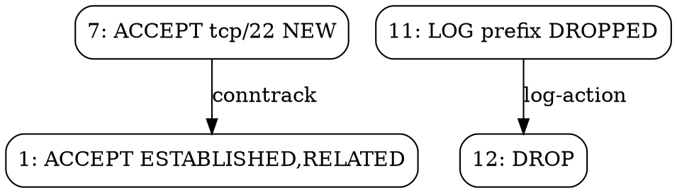

<!-- © AngelaMos | 2026 | 04-CHALLENGES.md -->

# Extension Challenges

These challenges build on the existing `fwrule` codebase. Each one references specific files and functions so you know where to start. They assume you have read `models.v`, the parsers, the analyzer, and the generator.

---

## Easy (1-2 hours each)

### 1. Add IPv6 Support to NetworkAddr

`ip_to_u32` in `src/models/models.v` converts dotted-quad strings to `u32`. IPv6 addresses are 128 bits, so this path fails entirely.

**What to do:**

- Add `ip_to_u128` in `models.v`. V has no native u128, so use two `u64` fields (upper and lower halves).
- Add `cidr_contains_v6` with the same shift-and-compare logic on the u64 pair. Shifts under 64 only touch the upper half. Shifts 64-128 need both.
- Update `cidr_contains` to check for `:` (IPv6) vs `.` (IPv4) and dispatch accordingly.
- In `parse_network_addr` (`common.v`), detect `:` and default `cidr` to 128 instead of 32. Constants `cidr_max_v4` and `cidr_max_v6` already exist in `config.v`.
- Update `NetworkAddr.str()` to omit the prefix when it equals the default for that address family.

**Files to modify:** `src/models/models.v`, `src/parser/common.v`, `src/analyzer/conflict.v`

**Verify with:**

```
2001:db8::/32 contains 2001:db8:1::/48       => true
2001:db8::/32 contains 2001:db9::/32          => false
::1/128 contains ::1/128                       => true
fe80::/10 contains 2001:db8::/32              => false
```

Gotcha: `::1` expands to `0:0:0:0:0:0:0:1`. Your parser needs to handle `::` shorthand.

---

### 2. Add a `stats` Command

Add a `stats` command to the CLI that reads a ruleset and prints: total rule count, rules per chain, rules per table, protocol distribution, and the top 5 destination ports.

**What to do:**

- Add `'stats'` to the subcommand match in `main.v`, pointing to a new `cmd_stats` function.
- Load the ruleset via `load_ruleset(args[0])`, iterate `rs.rules`, count with `map[string]int` for each dimension.

**Files to modify:** `src/main.v`

**Expected output for `fwrule stats testdata/iptables_complex.rules`:**

```
Ruleset Statistics
  Total rules:  24
  Format:       iptables

  Rules by chain:
    INPUT        14
    FORWARD       4
    OUTPUT        3

  Protocol distribution:
    tcp          16
    udp           4
    icmp          2
```

---

### 3. Support `--output` Flag for File Export

`cmd_export` and `cmd_harden` print to stdout. Add a `-o` / `--output` flag that writes to a file instead.

**What to do:**

- Both functions already use `flag.new_flag_parser`. Add: `output_path := fp.string('output', \`o\`, '', 'write to file instead of stdout')`
- After generating the output string, check `output_path`. Non-empty means `os.write_file(output_path, output)`. Empty means `println(output)` as before.
- Handle write errors with stderr and `config.exit_file_error`.

**Files to modify:** `src/main.v`

**Test:** `fwrule harden -s ssh,http -f nftables -o hardened.rules && cat hardened.rules`

---

### 4. Add SNAT/DNAT Rule Parsing

The `-j` handler in `parse_iptables_rule` in `iptables.v` sweeps everything after the action into `target_args` as a raw string. When the action is SNAT or DNAT, `--to-source` or `--to-destination` arguments carry the translated address, but that address never gets parsed into structured data.

The model already has `.snat` and `.dnat` in the `Action` enum and `parse_action` maps them correctly.

**What to do:**

- Add `nat_target ?NetworkAddr` to `Rule` in `models.v`.
- In the `-j` handler, when action is `.snat` or `.dnat`, scan tokens for `--to-source` / `--to-destination` and parse with `parse_network_addr`. Handle the `address:port` format by splitting on `:` first.
- Update `rule_to_iptables` in `generator.v` to emit the NAT target arguments.

**Files to modify:** `src/models/models.v`, `src/parser/iptables.v`, `src/generator/generator.v`

**Test input:**

```
*nat
:PREROUTING ACCEPT [0:0]
:POSTROUTING ACCEPT [0:0]
-A POSTROUTING -o eth0 -j SNAT --to-source 203.0.113.1
-A PREROUTING -i eth0 -p tcp --dport 80 -j DNAT --to-destination 10.0.0.5:8080
COMMIT
```

Parse and re-export. The `--to-source` and `--to-destination` arguments should round-trip correctly.

---

## Intermediate (3-6 hours each)

### 5. Live System Import

Run `iptables-save` or `nft list ruleset` as a subprocess and parse the output directly instead of reading a file.

V's `os.execute()` returns an `os.Result` with `exit_code` and `output`. That output string is what the existing parsers expect.

**What to do:**

- Add `--live` flag to `cmd_analyze` in `main.v`. When set, skip the file argument.
- Try `iptables-save` first. If exit code is 0, feed `result.output` to `parse_iptables()`. If it fails, try `nft list ruleset` and feed to `parse_nftables()`. If both fail, print a message about needing root or `CAP_NET_ADMIN`.

**Files to modify:** `src/main.v`, optionally `src/parser/common.v`

**Usage:** `sudo fwrule analyze --live`

---

### 6. UFW/firewalld Parsing

Parse UFW status output or firewalld zone XML into the same `Ruleset` model.

**UFW:** Lines like `22/tcp  ALLOW IN  Anywhere` map to INPUT chain ACCEPT rules. Detect UFW format by checking if the first non-empty line starts with `Status:`. Create `src/parser/ufw.v`.

**firewalld:** Zone XML in `/etc/firewalld/zones/` contains `<service name="ssh"/>` and `<port protocol="tcp" port="443"/>`. Map services to ports via `config.service_ports`. Use V's `encoding.xml`. Create `src/parser/firewalld.v`.

**Files to create:** `src/parser/ufw.v` and/or `src/parser/firewalld.v`

**Files to modify:** `src/parser/common.v` (extend `detect_format`)

---

### 7. Rule Dependency Graph

Build a directed graph where nodes are rules and edges are dependencies. Output DOT format for Graphviz.

**Dependency types to detect:**

- **Conntrack**: any rule with `.new_conn` state depends on the ESTABLISHED,RELATED rule
- **Log-action pair**: LOG at position `i` pairs with DROP/REJECT at `i+1`
- **NAT-filter**: DNAT in PREROUTING depends on ACCEPT in INPUT for the translated port

**Expected DOT output:**



**Files to create:** `src/graph/graph.v`

**Files to modify:** `src/main.v` (add `graph` subcommand)

---

### 8. Automated Fix Application

The analyzer suggests fixes as text. Build a fixer that applies them to the actual ruleset.

**Three operations:**

1. **Remove duplicates**: delete the second rule from "Duplicate rule" findings
2. **Reorder shadowed rules**: move the shadowed (more-specific) rule before the shadowing (less-specific) one
3. **Insert missing conntrack**: add an ESTABLISHED,RELATED ACCEPT at position 1 when flagged

The key difficulty: fixes interact. Removing rule 5 shifts rules 6+ down by one, invalidating indices in other findings. Process fixes from highest index to lowest.

**What to do:**

- Create `src/fixer/fixer.v` with `pub fn apply_fixes(rs Ruleset, findings []Finding) Ruleset`
- Add `fix` subcommand in `main.v` that runs analysis, applies fixes, and outputs the patched ruleset via the generator

**Files to create:** `src/fixer/fixer.v`

**Files to modify:** `src/main.v`

**Verify:** `fwrule fix testdata/iptables_conflicts.rules -f iptables | fwrule analyze /dev/stdin` should show fewer findings.

---

## Advanced (1-2 days each)

### 9. Rule Coverage Analysis

Given test packets, trace which rules each packet matches and identify dead rules.

Define a `Packet` struct (`src_ip`, `dst_ip`, `protocol`, `dst_port`). Parse a file with one packet per line. Walk the chain for each packet using `cidr_contains` for IPs and `port_range_contains` for ports. First matching terminal action wins (same as netfilter). Track hit counts per rule.

**Test packet file:**

```
192.168.1.100  10.0.0.5  tcp  443
10.0.0.1       10.0.0.5  tcp  22
203.0.113.50   10.0.0.5  tcp  3306
```

**Output:** Per-rule hit counts, list of dead rules (zero hits), accept/drop breakdown.

**Files to create:** `src/simulator/simulator.v`

**Files to modify:** `src/main.v` (add `simulate` subcommand)

---

### 10. Temporal Rule Analysis

Compare two ruleset versions and classify each change by security impact: exposure increase (new ACCEPT or removed DROP), exposure decrease (new DROP or removed ACCEPT), rate limit change, or policy change.

Diff at the semantic level using `criteria_equal` from `conflict.v` for matching, not string comparison. A policy change from DROP to ACCEPT on INPUT is always critical. Adding an ACCEPT for a new port is an exposure increase.

**Example output:**

```
EXPOSURE INCREASE: Port 3306 (mysql) now accessible from 0.0.0.0/0
EXPOSURE DECREASE: SSH is now rate-limited
POLICY CHANGE: INPUT default changed from DROP to ACCEPT
Summary: 3 increase exposure, 1 decrease, 2 neutral
```

**Files to create:** `src/analyzer/audit.v`

**Files to modify:** `src/main.v` (add `audit` subcommand)

---

### 11. PCAP Replay Against Ruleset

Parse a PCAP file (24-byte global header, 16-byte per-packet header, then raw packet data). Extract Ethernet (14 bytes), IP (source/dest IP, protocol), and TCP/UDP (ports) headers. Reuse the matching logic from Challenge 9 to simulate rule hits. Start with IPv4 TCP/UDP only.

Two approaches: parse the binary directly in V, or use C interop with libpcap.

**Files to create:** `src/simulator/pcap.v`

**Files to modify:** `src/main.v` (add `replay` subcommand)

---

### 12. CIS Benchmark Compliance Check

Check a ruleset against CIS Benchmark controls for Linux firewalls:

| Control | Requirement | Detection |
|---------|-------------|-----------|
| 3.5.1.1 | Default deny on INPUT | `rs.policies["INPUT"]` is `.drop` or `.reject` |
| 3.5.1.2 | Default deny on FORWARD | `rs.policies["FORWARD"]` is `.drop` or `.reject` |
| 3.5.1.3 | Loopback allowed | Rule with `in_iface == "lo"` and `.accept` |
| 3.5.1.4 | Loopback source blocked | Rule blocking `127.0.0.0/8` on non-lo interfaces |
| 3.5.1.5 | Conntrack configured | ESTABLISHED,RELATED rule exists |
| 3.5.1.6 | Drop logging | LOG rule in chains with DROP policy |

**Files to create:** `src/analyzer/compliance.v`

**Files to modify:** `src/main.v` (add `compliance` subcommand)

---

## Expert (Multi-day projects)

### 13. Binary Decision Diagram (BDD) Conflict Detection

Replace the O(n^2) pairwise comparison in `conflict.v` with BDD-based analysis. Each bit of each packet field (88 BDD variables for IPv4: 32 src_ip + 32 dst_ip + 8 protocol + 16 dst_port) becomes a BDD variable. Each rule becomes a BDD that is true for matching packets. Shadowing: `B AND (NOT A)` is empty. Contradiction: intersection is non-empty with opposing actions.

Implement BDD operations in V (`bdd_var`, `bdd_and`, `bdd_or`, `bdd_not`, `bdd_is_empty`) or use C interop with BuDDy/CUDD.

**Research:** Al-Shaer and Hamed, "Discovery of Policy Anomalies in Distributed Firewalls" (2004).

**Files to create:** `src/bdd/bdd.v`, `src/analyzer/bdd_conflict.v`

---

### 14. Distributed Firewall Analysis

Analyze rulesets from multiple hosts to find path-level issues. Host A's OUTPUT allows port 3306 to Host B, but Host B's INPUT drops it. Neither host looks misconfigured alone.

Input format: `hostname interface_ip ruleset_file` per line. For each host pair, check OUTPUT-allows vs INPUT-allows reachability. Report per-pair, per-port results. Watch for NAT transforming addresses mid-path.

**Files to create:** `src/analyzer/distributed.v`, `src/topology/topology.v`

**Files to modify:** `src/main.v` (add `topology` subcommand)

---

### 15. Real-Time Rule Monitoring

Poll `iptables -L -v -n` at intervals (default 5s), parse packet/byte counters, compute deltas, and maintain a rolling 60-sample window. Alert when: a zero-hit rule starts getting hit, a rule exceeds 2x its rolling average, or a DROP rule accumulates hits rapidly.

```
[14:32:15] ALERT: Rule 5 (DROP tcp/3306) spike: 847 pkts/5s (avg: 2 pkts/5s)
[14:32:20] ALERT: Rule 3 (ACCEPT tcp/22) spike: 312 pkts/5s (avg: 8 pkts/5s)
```

**Files to create:** `src/monitor/monitor.v`

**Files to modify:** `src/main.v` (add `monitor` subcommand)

---

### 16. Formal Verification with SMT Solver

Encode rules as SMT bitvector constraints and use Z3 to prove properties like "no external traffic reaches port 3306." If UNSAT, the property holds. If SAT, Z3 gives you the specific packet that violates it.

Encode chain evaluation as nested if-then-else over rule match formulas. Use V's C interop for Z3's C API, or shell out with SMT-LIB2 input.

**Research:** Kazemian et al., "Header Space Analysis: Static Checking for Networks" (2012).

**Files to create:** `src/verifier/verifier.v`, `src/verifier/smt.v`

**Files to modify:** `src/main.v` (add `verify` subcommand)

---

## How to Approach These

- Pick one from each level as you progress
- Write tests first (at least 5 cases per challenge) in `src/<module>/<module>_test.v`
- Follow the existing pattern: models define data, parsers consume text, analyzers produce findings, generators produce text
- Run `v fmt -w src/` and `v test src/` after every change
- If a challenge feels too big, break it into pieces and test each piece independently
